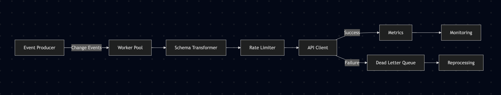

# Architecture Daigram

## Key Component Responsibilities
1. Schema Transformer

    - Converts between internal/external data models

    - Handles field renaming and type conversions

    - Validates against provider-specific schemas

2. Rate Limiter

    - Uses Redis for sync

    - Implements token bucket algorithm

3. API Client [External System]

    - Manages API authentication

    - Implements idempotency keys for retries

4. Worker Pool

    - Dynamic worker allocation per provider

    - Concurrent processing 

    - Automatic retries

5. Dead Letter Queue

    - Persistent storage for failed records

    - Maintains error context and stack traces

    - Supports manual reprocessing/replay

    - Integrates with alerting systems

6. Metrics Recorder

    - Tracks success/failure rates

    - Monitors API latency

    - Measures rate limit utilization

    - Exposes Prometheus metrics endpoint

## Failure Handling Strategies
1. Transient Failures

    - Exponential backoff

    - Retry budget/count enforcement

2. Permanent Failures

    - Dead letter queue with error classification

    - Alerting for manual intervention

    - Failure rate-based circuit breaking

3. System Failures

    - Graceful shutdown with drain mode

    - Pod health checks

